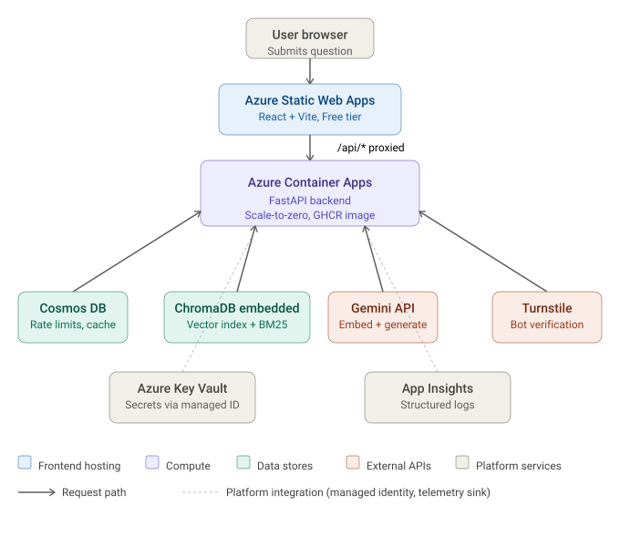

# Indian Robbery Law RAG

> A retrieval-augmented question-answering system for Indian robbery law (BNS §§309-311, IPC §§390-402). Built as a portfolio project demonstrating production-grade RAG engineering on a ~Rs 500/month budget.
>
> **Educational research prototype — not legal advice.**

[](https://github.com/sarthakdixit/indian-robbery-rag/actions/workflows/backend-ci.yml)
[](https://github.com/sarthakdixit/indian-robbery-rag/actions/workflows/backend-deploy.yml)
[](https://github.com/sarthakdixit/indian-robbery-rag/actions/workflows/frontend-ci.yml)
[](https://github.com/sarthakdixit/indian-robbery-rag/actions/workflows/frontend-deploy.yml)
[](LICENSE)

---

## 🔗 Try the live demo

**[mango-coast-00d276f00.7.azurestaticapps.net](https://mango-coast-00d276f00.7.azurestaticapps.net)**

Ask a question about Indian robbery law. Every answer cites the statutes and judgments it draws from. The system is anonymous, rate-limited (5 questions per IP per day), and runs on free or near-free cloud tiers.



<!-- A more detailed walkthrough lives in the "Request lifecycle" section below.
     The SVG above is the canonical architecture diagram for the project. -->

---

## The problem

Indian legal research is hard for two reasons that compound each other.

**Fragmentation.** Statutes live at [indiacode.nic.in](https://www.indiacode.nic.in). Judgments live at [indiankanoon.org](https://indiankanoon.org/) and behind subscription paywalls at SCC Online and Manupatra. Each source has its own search UX, none of which connect to the others. A first-year law student spending an evening trying to understand "when does theft become robbery" has to read three statute provisions across two acts, a half-dozen Supreme Court rulings, and reconcile them by hand.

**The IPC-to-BNS transition.** The Bharatiya Nyaya Sanhita 2023 came into force on July 1, 2024, replacing the Indian Penal Code 1860 for new offences. Pre-2024 offences are still prosecuted under IPC. So current legal practice mixes two penal codes — and most generic legal AI tools still answer with IPC-only language, missing both the new section numbers and the transitional rules. Any robbery question asked in 2026 has to handle both regimes.

This project is a focused RAG system on one narrow but doctrinally rich slice — robbery offences. It cites real authorities (acts and cases linked directly to indiacode.nic.in and indiankanoon.org), handles the IPC-to-BNS mapping, and refuses to answer out-of-scope questions rather than hallucinating into adjacent law.

Why robbery specifically? It's the smallest slice with enough doctrinal depth to be interesting: the theft-plus-force-or-fear ingredient analysis, the dacoity threshold at five or more accused, deadly-weapon enhancements under §397 IPC / §311(2) BNS, the bail jurisprudence. Wide enough to be a real eval task, narrow enough that a single developer can curate ground-truth answers for a 60-question eval set.

---

## Architecture

```
[User Browser]
     │
     ▼
[Azure Static Web Apps]  ──► React + Vite + TypeScript
     │  (/api/* proxied via SWA Backend Linking)
     ▼
[Azure Container Apps]   ──► FastAPI backend (scale-to-zero)
     │
     ├──► [Cloudflare Turnstile]   verify bot token
     ├──► [Azure Cosmos DB]        rate limits, exact+semantic cache, query logs
     ├──► [ChromaDB embedded]      vector retrieval (HNSW, 768-dim Gemini embeddings)
     ├──► [BM25 index]             keyword retrieval (bm25s, in-memory)
     ├──► [Gemini API]             embeddings (text-embedding-001) + generation (2.5 Flash-Lite)
     ├──► [Azure Key Vault]        secrets via user-assigned managed identity
     └──► [Application Insights]   structured logs + telemetry
```

A more detailed diagram lives in [`docs/architecture.md`](docs/architecture.md).

### Request lifecycle (happy path)

1. User submits question. React UI attaches a Cloudflare Turnstile token.
2. SWA proxies the request to the Container Apps backend.
3. Backend verifies the Turnstile token. Rejects if invalid.
4. Backend hashes the client IP (SHA-256 + salt) and checks the rate limit in Cosmos. 5 queries / IP / 24h.
5. Backend checks the global daily cap (kill switch).
6. Backend normalizes the query, checks the **exact-match cache**. Hit → return cached response.
7. Backend embeds the query via Gemini's embedding model.
8. Backend checks the **semantic cache** (cosine similarity threshold 0.92). Hit → return cached response.
9. Backend runs **hybrid retrieval**: BM25 (top 20) ⊕ vector (top 20) → reciprocal-rank-fused → top 5.
10. Backend checks the top result's similarity. If below 0.55 → **out-of-scope rejection** with suggested in-scope questions. (Rejection does NOT count toward the rate limit.)
11. Backend builds the augmented prompt and calls Gemini for generation.
12. Backend runs **citation verification** — every `[1]`, `[2]` reference in the generated text must point to a chunk in the retrieved set, or it's stripped.
13. Backend writes the query log, increments counters, stores the cache entry.
14. Backend returns the structured response. React renders the answer with expandable citation cards.

End-to-end p95 latency target: **under 4s** warm. Observed p95 on the deployed system: ~10s (cold-start adds 8-12s on the first hit after scale-down).

---

## Tech stack

| Layer                  | Choice                                                             |
| ---------------------- | ------------------------------------------------------------------ |
| Frontend framework     | React 18 + Vite + TypeScript (strict mode)                         |
| Frontend styling       | Tailwind CSS + shadcn/ui                                           |
| Frontend hosting       | Azure Static Web Apps (Free tier, eastasia region)                 |
| Backend framework      | Python 3.11 + FastAPI                                              |
| Backend hosting        | Azure Container Apps (scale-to-zero)                               |
| Backend image registry | GitHub Container Registry (GHCR), public                           |
| Vector database        | ChromaDB embedded, baked into the Docker image                     |
| Keyword retrieval      | bm25s (Rust-backed, 100× faster than rank-bm25)                    |
| Generation LLM         | Google Gemini 2.5 Flash-Lite                                       |
| Embeddings             | Google `gemini-embedding-001` (768-dim, MRL)                       |
| Document storage       | Azure Cosmos DB (serverless, single container, type-discriminated) |
| Secrets                | Azure Key Vault with user-assigned managed identity                |
| Bot protection         | Cloudflare Turnstile                                               |
| Telemetry              | Azure Application Insights + structlog JSON renderer               |
| CI/CD                  | GitHub Actions with OIDC federation to Azure                       |
| Infrastructure as code | Bicep (modules per resource type)                                  |

Why each of these? See [`docs/design-decisions.md`](docs/design-decisions.md) — a FAQ covering every non-obvious technology choice.

---

## Evaluation

The eval set is a 59-question hand-curated JSONL file at [`eval/robbery_questions.jsonl`](eval/robbery_questions.jsonl) covering four categories:

| Category          | Questions | Tests                                                          |
| ----------------- | --------- | -------------------------------------------------------------- |
| `ingredient`      | 15        | Doctrinal understanding of theft, robbery, dacoity ingredients |
| `sentencing_bail` | 15        | Statutory punishment, bail jurisprudence, sentencing factors   |
| `ipc_bns_mapping` | 14        | IPC-to-BNS section mapping and transitional rules              |
| `out_of_scope`    | 15        | Hard rejection of adjacent offences, general procedure, trivia |

The eval harness lives in [`eval/`](eval/) and measures:

- **Section citation recall** — fraction of expected statutory sections present in the response's citations
- **Case citation recall** — same for judgment citations, with case-name normalization
- **Theme coverage** — LLM-as-judge (Gemini) scores whether the answer substantively covers the expected themes
- **Overall quality** — judge rubric 1-5
- **Rejection accuracy** — for out-of-scope questions, did the system correctly refuse to answer?
- **Latency p50 / p95** — backend-reported, per-category

Run it yourself:

```bash
# Full baseline, judge enabled (15-25 min, uses Gemini free tier)
GEMINI_API_KEY=... python eval/run_eval.py --target deployed --judge

# Local smoke test, no judge (1-2 min)
python eval/run_eval.py --target local --no-judge --subset 5
```

Results land in [`eval/results/`](eval/results/) — both a machine-readable `baseline.json` and a Markdown report.

> **Baseline numbers pending.** The eval harness is complete and tested end-to-end against the live system. Full baseline numbers will be published after the next Gemini free-tier quota window (free tier resets daily). Once available, this section will be replaced with a results summary and a link to the full report.

### Honest limitations of the eval

- **No retrieval@K, only citation-recall@N.** The public `/api/query` doesn't surface retrieved-but-not-cited chunks, so we measure what made it into the answer rather than what was retrieved. This is a stricter signal — citations are post-verification — but it conflates retrieval and generation quality. A follow-up could add a retrieval-only endpoint to separate the two.
- **Judge bias.** The judge is Gemini, the same model family the system uses for generation. It may be over-charitable. Human review pending; see [`eval/REVIEW_NOTES.md`](eval/REVIEW_NOTES.md) for the audit trail.
- **Generation non-determinism.** Theme coverage and quality scores drift ±5-10% across runs. Retrieval and citation metrics are stable.

---

## Local development

Prerequisites: Python 3.11, Node 20, `uv` or `pip`, `pnpm`, a Gemini API key.

```bash
# 1. Clone
git clone https://github.com/sarthakdixit/indian-robbery-rag.git
cd indian-robbery-rag

# 2. Backend
cd backend
python -m venv .venv && source .venv/bin/activate
pip install -r requirements.txt
cp .env.example .env
# Edit .env to set GEMINI_API_KEY=...

# 3. Frontend
cd ../frontend
pnpm install
cp .env.example .env.local
# Edit .env.local: VITE_API_BASE_URL=http://localhost:8000

# 4. Build the ChromaDB index (one-time, ~5 minutes)
cd ../ingestion
pip install -r requirements.txt
python run_ingestion.py    # reads data/, writes ingestion/data/chroma_db/

# 5. Run backend + frontend
cd ../backend
uvicorn backend.app.main:app --reload  # http://localhost:8000

# In another terminal:
cd frontend
pnpm dev    # http://localhost:5173
```

That's the local-first development story — no Azure access needed for the full pipeline. Every external dependency has a local adapter (SQLite in place of Cosmos, dotenv in place of Key Vault, stdout in place of App Insights). See [`AGENT.md`](AGENT.md) for the dependency-injection details.

---

## Cost analysis

Target budget: **Rs 500/month**. Actual observed: well under, mostly from Log Analytics (~Rs 50-100) and Key Vault (~Rs 50).

| Component                   | Service                               | Monthly cost         |
| --------------------------- | ------------------------------------- | -------------------- |
| Generation LLM + embeddings | Google Gemini                         | Rs 0 (free tier)     |
| Vector database             | ChromaDB embedded                     | Rs 0                 |
| Frontend hosting            | Azure SWA Free                        | Rs 0                 |
| Backend hosting             | Container Apps (scale-to-zero)        | Rs 0-100             |
| Document storage            | Cosmos DB free tier (1000 RU/s, 25GB) | Rs 0                 |
| Backend image               | GHCR public                           | Rs 0                 |
| Secrets                     | Azure Key Vault                       | ~Rs 50               |
| Logs                        | Log Analytics workspace               | ~Rs 50-100           |
| Monitoring                  | Application Insights free tier        | Rs 0                 |
| **Total**                   |                                       | **Rs 100-250/month** |

Headroom against the Rs 500 budget: ~Rs 250-400/month. Comfortable for occasional traffic spikes during demo periods.

For the full breakdown — assumptions, what grows with traffic, kill-switch behavior — see [`docs/cost-analysis.md`](docs/cost-analysis.md).

---

## Known limitations

Explicit non-goals so reviewers know what's intentionally out of scope:

- **Single-turn only.** No conversation history, no follow-up context. The system was designed around stateless query/answer, not chat.
- **English only.** No Hindi or other Indian-language support.
- **Robbery only.** Adjacent offences (theft alone, extortion alone, criminal breach of trust) are deliberately rejected as out-of-scope. The system says "I don't know" loudly rather than hallucinating into adjacent law. Expanding the scope is a corpus + eval-set task, not a code task.
- **Annual corpus refresh.** Statutes and case law are updated annually, not in real-time. No live web scraping.
- **No SLA.** Best-effort hosting on free tiers. May scale down to zero and take ~10s to wake on the first request. May be unavailable during the global daily cap kill-switch.
- **Not legal advice.** The system has a prominent disclaimer banner and a first-visit modal. A real legal question requires a licensed advocate, not an LLM.

Things the project is _intended_ to demonstrate, even imperfectly:

- Production-grade RAG engineering on free tier (citations, scope guards, caching, rate limits)
- Local-first development (no Azure access required to run end-to-end)
- IaC-driven deployment (one Bicep run provisions everything)
- Honest eval (a real ground-truth dataset and a real harness with documented limitations)

---

## Repository structure

```
indian-robbery-rag/
├── backend/                FastAPI app, RAG pipeline, security middleware
│   ├── app/
│   │   ├── adapters/       Cloud-replaceable implementations
│   │   ├── protocols/      Interface definitions
│   │   ├── rag/            Retrieval, prompt, generation, citation verification
│   │   ├── routes/         FastAPI endpoints (query, admin, health)
│   │   ├── schemas/        Pydantic request/response models
│   │   ├── security/       Turnstile, rate limit, circuit breaker
│   │   └── telemetry/      Structured logs, query log, cost tracker
│   └── tests/
├── frontend/               React + Vite + TypeScript SPA
│   └── src/
├── ingestion/              Offline corpus → ChromaDB index pipeline
│   ├── collect/            Manifest + verification
│   ├── classify/           Gemini-based relevance classifier
│   ├── normalize/          HTML/PDF parsing
│   ├── chunk/              Section/paragraph chunking with metadata
│   ├── embed/              Gemini embedding client
│   └── index/              ChromaDB + BM25 index builder
├── eval/                   Eval set + harness
│   ├── robbery_questions.jsonl   59 ground-truth questions
│   ├── run_eval.py         Async orchestrator
│   ├── metrics.py          Pure scoring functions
│   ├── llm_judge.py        Gemini-as-judge
│   └── results/            Generated metrics + reports
├── infra/                  Azure Bicep + deploy scripts
│   ├── main.bicep          Top-level orchestrator
│   └── modules/            One Bicep module per resource type
├── data/                   Raw corpus (bare-act PDFs + judgment HTML/PDF pairs)
├── docs/                   Architecture, design decisions, cost analysis
├── AGENT.md                Python coding conventions
├── AGENT-frontend.md       TypeScript + React conventions
└── design.md               Architecture decisions, batch plan
```

For each subdirectory, the README in that directory explains its specific responsibility.

---

## Contributing

This is primarily a portfolio project, but contributions are welcome — especially:

- **Eval-set review.** A law student or junior advocate willing to spot-check 15-20 questions and flag any factual errors. Credit in this README.
- **Additional eval questions.** Particularly in `sentencing_bail` and `ipc_bns_mapping`, where the doctrinal depth is harder to cover with 15 questions.
- **Corpus expansion.** Additional case law for robbery — particularly recent BNS rulings as they accumulate.

See [`CONTRIBUTING.md`](CONTRIBUTING.md) for the workflow. Issues tagged `good-first-issue` are intentionally bounded.

---

## Acknowledgements

- **Indian Kanoon** for making case law accessible. Every judgment citation links back to their pages.
- **India Code** ([indiacode.nic.in](https://www.indiacode.nic.in/)) for the authoritative bare-act PDFs.
- **Anthropic, OpenAI, and Google** for the LLM ecosystem that made this practical to build in evenings and weekends.
- **The shadcn/ui project** for the design tokens and component primitives that let one developer ship a presentable frontend.

---

## License

MIT — see [`LICENSE`](LICENSE).

---

## Author

**Sarthak Dixit**  
[github.com/sarthakdixit](https://github.com/sarthakdixit)

Built as a portfolio piece for AI/ML engineering roles and legal-tech work. If you're hiring for either, [my profile is here](https://github.com/sarthakdixit) — happy to walk through any part of the system.
